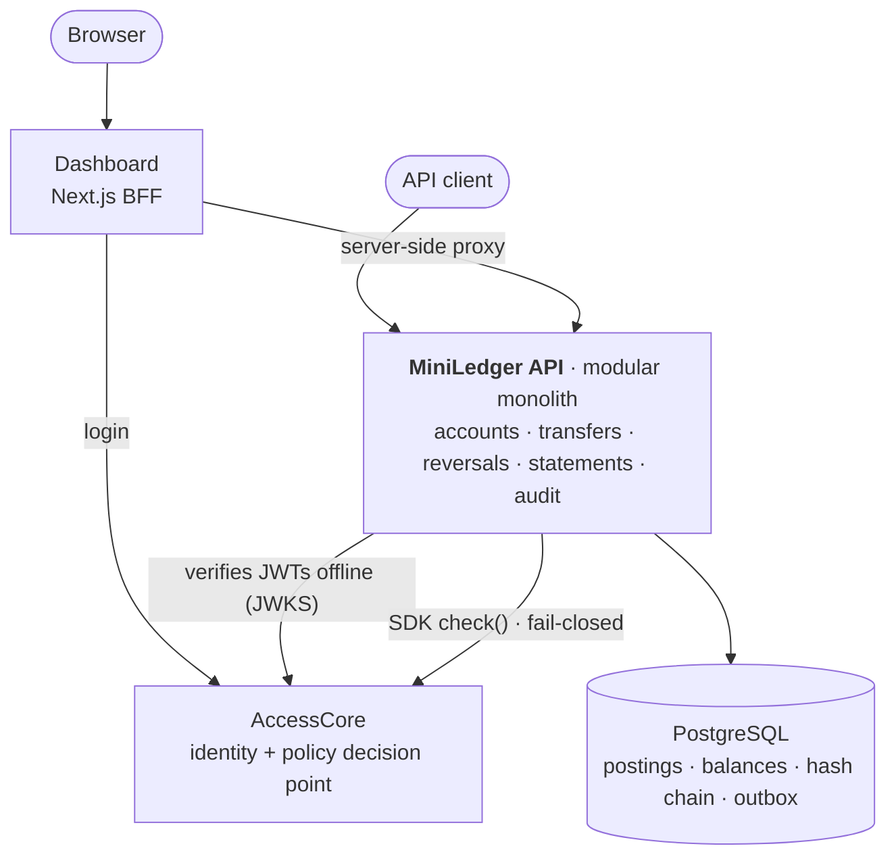
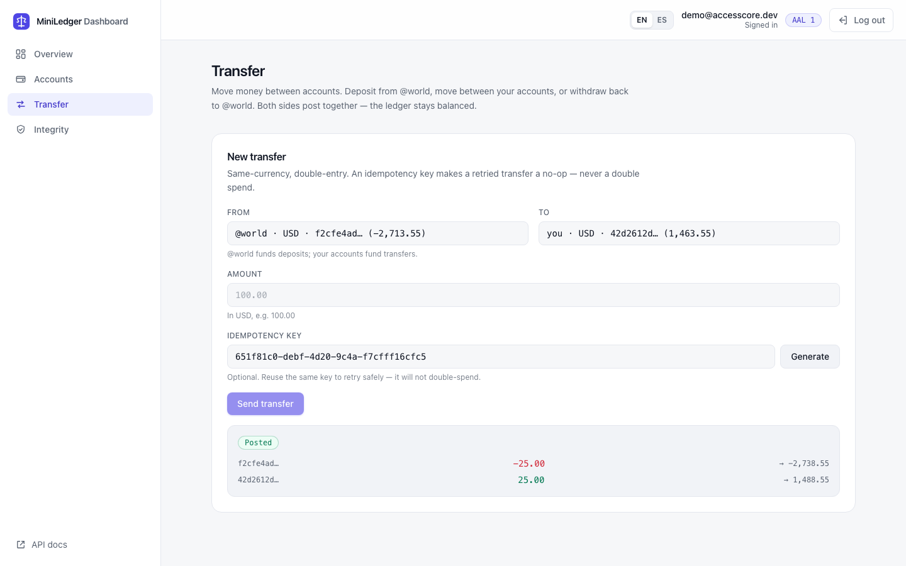
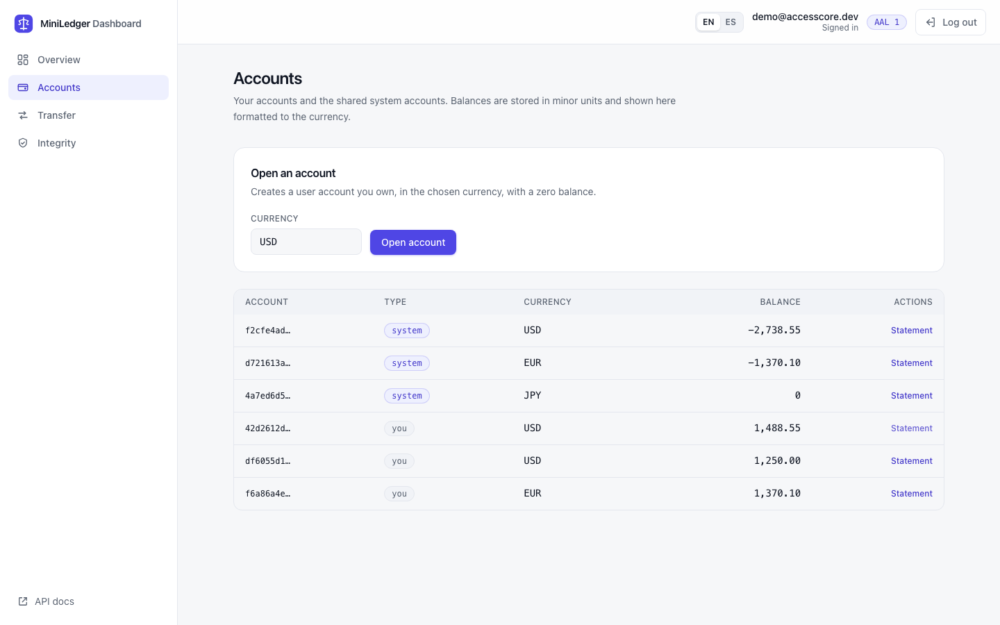
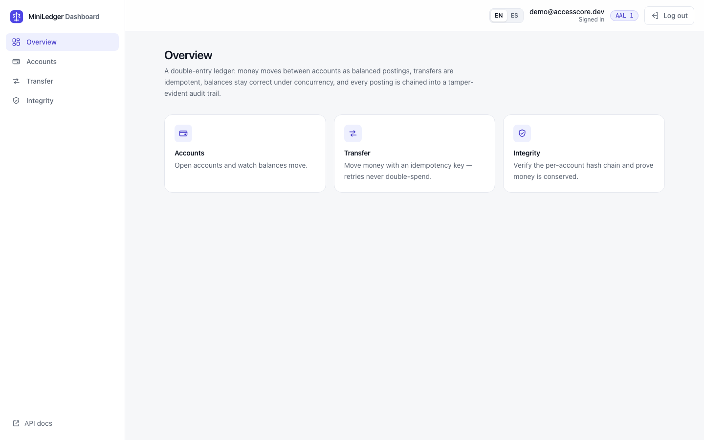

# MiniLedger

**A double-entry financial ledger API.** Transfers are idempotent, balances stay correct under
concurrency, and every posting goes into a tamper-evident audit trail. Authentication and
authorization are delegated to [AccessCore](https://github.com/diegowritescode/accesscore) through
its published SDK.

[](https://github.com/diegowritescode/miniledger/actions/workflows/ci.yml)
[](https://github.com/diegowritescode/miniledger/actions/workflows/security.yml)
[](https://github.com/diegowritescode/miniledger/actions/workflows/release.yml)


[](LICENSE)

|                   |                                                                                                                                   |
| ----------------- | --------------------------------------------------------------------------------------------------------------------------------- |
| **Dashboard**     | [app.ledger.deviego.xyz](https://app.ledger.deviego.xyz)                                                                          |
| **API reference** | [ledger.deviego.xyz/docs](https://ledger.deviego.xyz/docs) (OpenAPI)                                                              |
| **Demo login**    | `demo@accesscore.dev` / `correct horse battery staple` (an AccessCore account; data resets nightly)                               |
| **Depends on**    | [AccessCore](https://github.com/diegowritescode/accesscore): JWKS for offline token checks, and its PDP for every privileged call |


## Where to look first

- **Double entry, enforced twice.** A transaction is built only when its postings sum to zero
  ([`journal-transaction.ts`](src/ledger/domain/journal-transaction.ts)). A deferred Postgres
  `CONSTRAINT TRIGGER` rejects any unbalanced commit that bypasses the domain
  ([ADR-005](docs/adr/005-double-entry-model.md)).
- **Correct under concurrency.** Balance rows are locked with `SELECT … FOR UPDATE` in a total
  order, so concurrent transfers cannot deadlock. A real-Postgres test fires concurrent transfers
  and proves there is no lost update and no overdraft
  ([`transfer.concurrency.int-spec.ts`](test/integration/transfer.concurrency.int-spec.ts),
  [ADR-006](docs/adr/006-concurrency-safe-balances.md)).
- **Exactly-once transfers.** The `Idempotency-Key` is claimed in the same transaction as the
  postings and fingerprinted with the caller. A retry replays the original receipt, and a
  concurrent duplicate runs once ([ADR-007](docs/adr/007-idempotency.md)).
- **Tamper evidence you can re-verify.** Each account's postings form a SHA-256 hash chain,
  reconciled to the stored balance, and a conservation check proves every currency nets to zero
  ([ADR-008](docs/adr/008-audit-hash-chain.md)).
- **Measured, not claimed.** About 1,000 transfers/s sharded, and about 510/s on one lock-serialized
  hot account (k6, [`performance.md`](docs/performance.md)). Merged coverage is about 99% of lines,
  and the mutation score on the ledger domain is 100%.

## Architecture at a glance



A hexagonal modular monolith with DDD tactical patterns: the ledger domain has no framework or
database imports, and [dependency-cruiser](.dependency-cruiser.cjs) fails the build if that
changes. Full detail is in [`docs/architecture.md`](docs/architecture.md). Every significant decision
is an ADR in [`docs/adr/`](docs/adr/) (001–014).

<details>
<summary><b>More screenshots</b>: transfer receipt, statement, accounts</summary>

|                                                                                                                                |                                                                                                                        |
| ------------------------------------------------------------------------------------------------------------------------------ | ---------------------------------------------------------------------------------------------------------------------- |
|     |  |
|  |                                                                                                                        |

</details>

## Business Problem

The proof of a _critical backend_: moving money must be exactly-once, never lose or invent value,
and stay consistent under concurrent transfers — the elite backend signal (correctness +
concurrency). (Full context in [`docs/business-context.md`](docs/business-context.md).)

## Tech Stack

Node.js · NestJS · TypeScript · PostgreSQL · Drizzle ORM · `jose` · `nestjs-pino` · `prom-client` · `@nestjs/swagger` · `@diegowritescode/accesscore-sdk`
(Redis and RabbitMQ enter with later spine projects; idempotency here is Postgres-authoritative.)

## Data Model

Accounts, transactions, postings, and the audit log. Detail in [`docs/data-model.md`](docs/data-model.md).

## Authentication & Authorization

Every route except `/health`, `/ready`, `/metrics`, and `/docs` requires an **AccessCore bearer token**
(`Authorization: Bearer <jwt>`); in production the public edge does not route `/metrics` at all. Authorization is **hybrid**:

- **Authentication** — a local `AccessTokenGuard` verifies the AccessCore EdDSA (Ed25519) token
  **offline** against AccessCore's JWKS (`iss`/`aud`/`exp`/`nbf`, 30 s skew) and attaches the
  principal; no round-trip needed to authenticate.
- **Capability (AccessCore PEP)** — privileged routes forward the token to AccessCore's `check()`
  for `ledger.open` / `ledger.transfer` / `ledger.audit` / `ledger.reverse` on
  `{type:'ledger', id:'miniledger'}`; deny → 403, PDP unreachable → **503 (fail-closed)**.
- **Ownership (local)** — `accounts.owner_id` scopes reads to the caller (a non-owner `GET
/accounts/:id` returns 404, not 403) and requires source-account ownership to transfer (`@world`
  exempt).

**Getting a token in dev.** Mint an AccessCore access token via its login flow, or (as the tests do)
sign a short-lived EdDSA JWT with a keypair whose public JWK is served at `ACCESSCORE_JWKS_URL`, with
`iss = ACCESSCORE_JWT_ISSUER`, `aud = ACCESSCORE_JWT_AUDIENCE`, and `sub` = the granted subject. The
subject must hold the `operator` relation on the `ledger` resource in AccessCore (see the seeding
runbook in [`docs/security.md`](docs/security.md)). Full model in [`docs/security.md`](docs/security.md).

## Testing Strategy

Unit / integration / E2E, with **property-based tests (fast-check)** of the ledger invariants and a
real-Postgres concurrency test of the balance locks. A single **merged** coverage gate (nyc across
all three suites) enforces **90% lines / 90% statements / 85% functions / 75% branches**; the latest
run sits around **~99% lines, ~98% statements, 100% functions, ~86% branches**. See
[`docs/testing-strategy.md`](docs/testing-strategy.md).

## Deployment

Deployed at [`https://ledger.deviego.xyz`](https://ledger.deviego.xyz) — GitHub Actions runs
`lint → typecheck → build → migrate → coverage`, then publishes immutable images to GHCR under the
commit SHA; the host runs them from a versioned Compose file behind Traefik TLS, with migrate-on-start
([ADR-014](docs/adr/014-container-release-and-shared-edge-deployment.md)). Runbook in [`docs/deployment.md`](docs/deployment.md).

The app runs as a **least-privilege database role** so the append-only ledger binds at runtime
([ADR-011](docs/adr/011-least-privilege-db-role.md)), emits **structured JSON logs** with per-request
correlation ids, and exposes **Prometheus metrics** at `/metrics` ([ADR-012](docs/adr/012-observability.md)).

## Dashboard

A web dashboard lives in [`web/`](web) — a **Next.js backend-for-frontend** deployed alongside the
API at [`https://app.ledger.deviego.xyz`](https://app.ledger.deviego.xyz). It signs in against
**AccessCore** (the browser never holds a token — it is kept in an httpOnly cookie and every call is
proxied server-side) and drives the ledger:

- **Accounts** — open accounts and read balances, formatted per currency.
- **Transfer** — move money with an optional idempotency key; the double-entry receipt shows both legs.
- **Statement** — an account's append-only posting history, cursor-paginated.
- **Integrity** — verifies **conservation of money** (per-currency totals net to zero) and each
  account's **hash chain** (intact, or broken at a known sequence) — the tamper-evidence made visible.

Light theme, English/Spanish. It is a separate deployable (its own image and domain, not a
workspace — [ADR-013](docs/adr/013-web-dashboard.md)); see [`web/README.md`](web/README.md) and the
[deploy runbook](docs/deployment.md#production--compose-behind-traefik).

## Demo

[`scripts/demo.sh`](scripts/demo.sh) walks the full ledger lifecycle against a running instance —
open accounts, deposit from `@world`, an idempotent retry, a transfer, the statement, a reversal, and
the audit hash-chain + conservation checks:

```bash
BASE_URL=https://ledger.deviego.xyz TOKEN=<accesscore-access-token> ./scripts/demo.sh
```

A real, annotated run against the **live** deployment (authenticated with a genuine AccessCore token)
is captured in [`docs/demo.md`](docs/demo.md) — the end-to-end proof that MiniLedger consumes AccessCore
in production.

## Trade-offs

- **Ordered row locks over `SERIALIZABLE`.** Locking the balance rows in a fixed order serializes only
  the accounts a transfer touches, with no retry storms. The cost is one hot account capping
  throughput (about 510 transfers/s, measured) ([ADR-006](docs/adr/006-concurrency-safe-balances.md)).
- **Idempotency in Postgres, not Redis.** Claiming the key in the same transaction as the postings
  makes "exactly once" a database guarantee, at the cost of one extra row per transfer
  ([ADR-007](docs/adr/007-idempotency.md)).
- **Capability check remote, ownership local.** AccessCore decides _may this caller move money at
  all_, and MiniLedger decides _is this their account_. That avoids a two-system commit on every
  account open ([ADR-009](docs/adr/009-accesscore-integration.md)).

Every decision, the alternatives considered, and what was deliberately left out are in
[`docs/trade-offs.md`](docs/trade-offs.md) and the ADRs.

## Future Improvements

The outbox relay (spine project #3, EventBridge) publishes the domain events MiniLedger already
writes; CQRS read models for reporting follow (spine project #4).

## How to Run

```bash
cp .env.example .env
docker compose up -d          # full stack (API on :3000 + PostgreSQL on host 5433)
# — or, for hot-reload development, run Postgres only and the app from the host:
docker compose up -d postgres
npm ci                        # installs the AccessCore SDK from public npmjs — no token needed
npm run db:migrate            # apply migrations to the running database
npm run start:dev
```

`docker compose up` boots the whole stack (API + Postgres) from a clean clone. The AccessCore SDK
(`@diegowritescode/accesscore-sdk`) resolves from the **public npm registry with no auth token**, so
that clone needs nothing but Docker. Point the `ACCESSCORE_*` variables (see
[`.env.example`](.env.example)) at a running AccessCore for authenticated requests; `/health` and
`/ready` need no token. A live instance runs at [`https://ledger.deviego.xyz`](https://ledger.deviego.xyz).

## Contributing & conventions

Local setup, the trunk-based workflow, commit conventions, and the quality gates are in
[`CONTRIBUTING.md`](CONTRIBUTING.md); community expectations in
[`CODE_OF_CONDUCT.md`](CODE_OF_CONDUCT.md). Report vulnerabilities per [`SECURITY.md`](SECURITY.md).

## License

[Apache-2.0](LICENSE).
