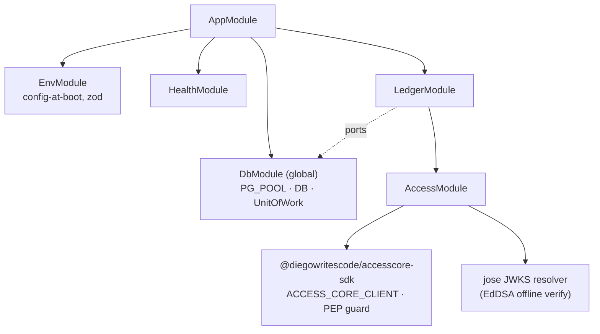

# Architecture

MiniLedger is a **hexagonal modular monolith with DDD tactical patterns** — one deployable
NestJS process, four layers per module, the domain kept pure so the ledger's invariants are
provable in isolation. The style and its boundary decisions are recorded in
[ADR-001](adr/001-architecture-style.md); the persistence discipline that makes the database the
final arbiter of correctness is [ADR-003](adr/003-persistence-and-orm.md).

## Style

- **Modular monolith, not microservices.** A transfer is one atomic consistency boundary that
  spans an account's balance and the postings that move it. Distributing accounts and postings
  across services would turn that single transaction into a distributed one (sagas/2PC, an
  eventual-consistency gap where money can momentarily appear unbalanced) for zero scaling payoff
  at this size ([ADR-001](adr/001-architecture-style.md)).
- **Hexagonal (Ports & Adapters).** Each module has four layers: `domain` (pure, no NestJS/ORM),
  `application` (use cases + repository ports), `infrastructure` (Drizzle/Postgres adapters), and
  `interface` (controllers, guards, DTOs). Dependencies point inward only.
- **DDD, one bounded context.** The `ledger` context holds exactly two aggregates:
  - **`Account`** — identity, currency, overdraft policy, and `ownerId`. Its balance is a
    materialized projection ([ADR-006](adr/006-concurrency-safe-balances.md)), not a field the
    domain freely mutates.
  - **`JournalTransaction`** + its child **`Posting`** entities — the transaction is the invariant
    boundary that guarantees `SUM(postings) = 0` in a single currency
    ([ADR-005](adr/005-double-entry-model.md)). A `Posting` has no life outside its transaction.
- **Single-package repo, not a workspace** ([ADR-002](adr/002-repository-shape.md)) — MiniLedger
  is one build unit, so it deliberately drops AccessCore's pnpm/Turbo/changesets tooling while
  keeping the same quality gates.

## Module boundaries

The NestJS modules and the layers they wire:

| Module                                          | Responsibility                                                                                                                                                                                         |
| ----------------------------------------------- | ------------------------------------------------------------------------------------------------------------------------------------------------------------------------------------------------------ |
| `ledger` (`src/ledger`)                         | The core domain and use cases — open account, transfer, and the read-side **audit** verifier. Holds the four layers (`domain`/`application`/`infrastructure`/`interface`) and every ledger controller. |
| `access` (`src/access`)                         | The AccessCore integration adapter: a local `AccessTokenGuard` (offline JWT verify) plus the SDK's capability PEP client and guard ([ADR-009](adr/009-accesscore-integration.md)).                     |
| `health` (`src/health`)                         | Liveness (`GET /health`) and readiness (`GET /ready`, a `SELECT 1` DB probe).                                                                                                                          |
| `shared` (`src/shared`, `src/db`, `src/config`) | Cross-cutting infrastructure: the `Money`/`Currency` value objects, the `Result` type, the RFC 7807 problem filter, the Drizzle `db` client, and the opaque-`Tx` `UnitOfWork`.                         |

The **audit** responsibility from [ADR-001](adr/001-architecture-style.md) is a read-only verifier
(`AuditService`/`AuditController`) that currently lives inside the `ledger` module and reaches the
tables through an `AuditRepository` port — it never writes. `access` and `audit` depend on
`ledger` only through explicit ports; no module reaches into another's internals.

### Module dependency graph



### Layers inside the `ledger` context

```
interface/        controllers (accounts, transfers, audit), DTOs, guards
    │  depends on
application/       AccountsService · TransferService · AuditService, repository PORTS
    │  depends on
domain/            Account · JournalTransaction · Posting · Money · Currency
                   hash-chain · overdraft · Result — pure, no NestJS/ORM
    ▲  implemented by
infrastructure/    Drizzle repositories + row↔domain mappers (adapters)
```

The application layer references only ports (`ACCOUNTS_REPOSITORY`, `ACCOUNT_BALANCES_REPOSITORY`,
`JOURNAL_TRANSACTIONS_REPOSITORY`, `IDEMPOTENCY_REPOSITORY`, `AUDIT_REPOSITORY`,
`UNIT_OF_WORK`, `CLOCK`); the Drizzle adapters in `infrastructure` implement them and are bound in
`LedgerModule`. The domain layer imports nothing from NestJS or Drizzle, which is what makes the
sum-zero, overdraft, and hash-chain rules unit- and property-testable with no IO.

## Key flows

### Transfer (`POST /transfers`)

1. **Authenticate** — `AccessTokenGuard` verifies the bearer EdDSA token offline against the
   AccessCore JWKS and attaches `request.principal` ([ADR-009](adr/009-accesscore-integration.md)).
2. **Authorize (capability)** — the SDK PEP (`@RequirePermission('ledger.transfer', …)`) forwards
   the token to AccessCore's `check()` on `{type:'ledger', id:'miniledger'}`; deny → 403, PDP down
   → **503 (fail-closed)**, before any database work.
3. **Validate** — the `ZodValidationPipe` checks the body (`from`/`to` UUIDs, `amount` a digit
   string, `currency`); the domain builds a balanced `JournalTransaction.transfer(from, to, money)`.
4. **One unit of work** ([ADR-003](adr/003-persistence-and-orm.md)) — inside a single DB
   transaction: claim the `Idempotency-Key` if present ([ADR-007](adr/007-idempotency.md)); check
   local ownership (`from` must be owned by the caller, `@world` exempt); lock the involved
   `account_balances` rows with `SELECT … FOR UPDATE` **ordered by account id**
   ([ADR-006](adr/006-concurrency-safe-balances.md)); guard overdraft on the locked balance; append
   postings with their per-account hash-chain links ([ADR-008](adr/008-audit-hash-chain.md)); and
   update each balance and chain head. Commit applies the deferred sum-zero trigger.
5. **Respond** — a `TransferReceipt` (the transaction id and each leg's signed `amount` and
   `balanceAfter`, bigints serialized as strings), stored under the idempotency key for replay.

### Open account (`POST /accounts`)

Authenticate → authorize `ledger.open` → in one unit of work insert the `accounts` row with
`owner_id = principal.subject` and initialize its `account_balances` row at `0`, so an account
never exists without its balance row.

## Key patterns

- **`Result` / domain errors.** `domain` and `application` return `Result<T, E>` with a typed
  error union (e.g. `TransferError`); exceptions are reserved for genuine infrastructure failure.
  HTTP status mapping happens only in the `interface` layer.
- **Opaque-`Tx` unit of work.** `unitOfWork.withTransaction(tx => …)` passes an opaque `Tx` handle
  — never Drizzle's transaction type — so the application layer stays free of the ORM while the
  postings, balance update, and idempotency claim commit atomically
  ([ADR-003](adr/003-persistence-and-orm.md)).
- **RFC 7807 problem details.** A global `ProblemDetailsFilter` renders every error as
  `application/problem+json` with `type`/`title`/`status`/`detail`.
- **Config-at-boot.** `src/config/env.ts` parses and validates the environment with a zod schema at
  startup (including the `ACCESSCORE_*` variables); an invalid environment fails fast rather than at
  first request.

## Non-functional concerns

- **Performance.** Balance reads are `O(1)` from the materialized `account_balances` row rather than
  a `SUM()` over history ([ADR-006](adr/006-concurrency-safe-balances.md)).
- **Consistency & availability.** Correctness is enforced by the database (deferred sum-zero
  trigger, ordered row locks, `REVOKE`), so it holds even against writes that bypass the domain.
  Privileged operations depend on AccessCore's PDP and are **fail-closed**; ownership-scoped reads
  stay local and remain available if the PDP is down.
- **Auditability.** Append-only postings plus a per-account hash chain make history reconstructable
  and tamper-evident; the `audit` verifier cross-checks chain integrity, reconciliation, and
  conservation ([ADR-008](adr/008-audit-hash-chain.md)).
- **Observability.** Structured startup logging and the `/health` + `/ready` probes; deeper metrics
  and tracing are a later hardening item.
- **Extensibility.** A future outbox is the seam to EventBridge (spine project #3) without reshaping
  the domain ([ADR-001](adr/001-architecture-style.md)).
